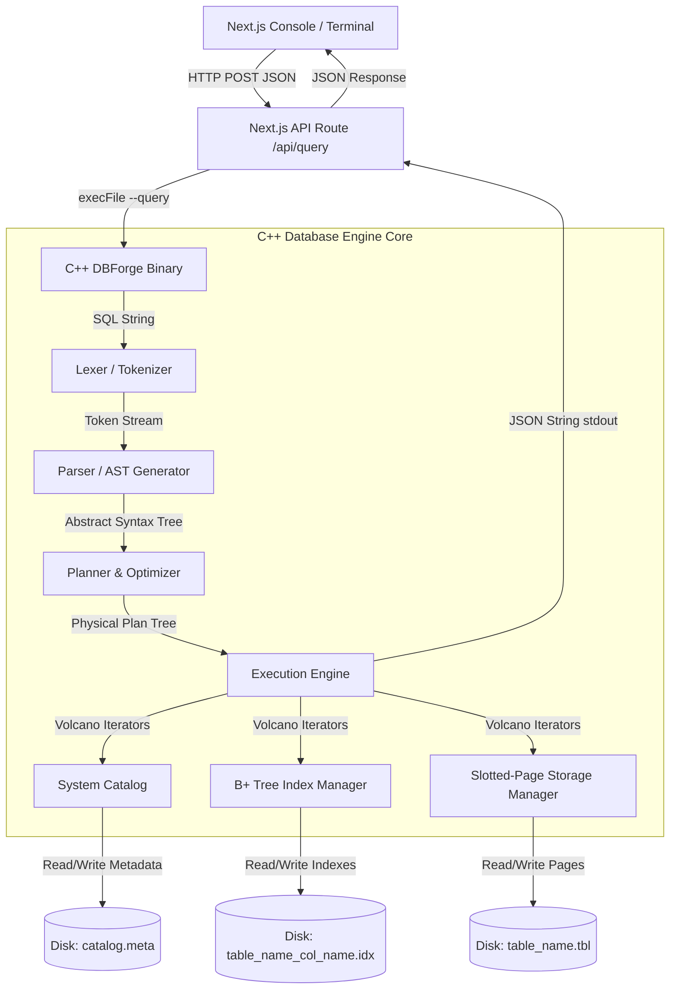

# DBForge: Custom RDBMS & Query Processor
## Interview Preparation & Architectural Study Guide

Welcome! Having a custom-built database engine on your resume is one of the strongest ways to stand out. It demonstrates deep knowledge of C++ system design, low-level binary serialization, index structures (B+ Trees), compilers (Lexers/Parsers), and database query planning/execution models.

This guide provides a comprehensive breakdown of the **DBForge** engine, its architecture, and exact talking points you can use to explain it to interviewers.

---

## 1. System Architecture Overview

DBForge is an end-to-end relational database management system (RDBMS) consisting of a **C++ Database Engine Core** and a **Next.js Web Dashboard** for administration and optimization. 

Here is the lifecycle of a query from the user console down to raw bits on disk:



---

## 2. Deep Dive: Layer-by-Layer Implementation

### 📁 A. The Storage Layer: Slotted-Page Storage
*   **Location**: [page.h](file:///c:/ramu/project/MINI_DB/src/storage/page.h) & [storage_manager.cpp](file:///c:/ramu/project/MINI_DB/src/storage/storage_manager.cpp)
*   **The Problem It Solves**: In a database, rows can have variable lengths (e.g., text columns). If you append rows sequentially, updating a row with a longer string would overwrite subsequent rows. If you leave empty gaps, you waste space (fragmentation).
*   **The Slotted-Page Layout (4096 Bytes)**:
    *   **Header (8 bytes)**: `PageID` (4B) | `RecordCount` (2B) | `FreeSpaceOffset` (2B).
    *   **Slot Array**: Grows **forward** from the top of the page. Each slot is 4 bytes (2B offset, 2B length).
    *   **Records Storage**: Grows **backward** from the bottom of the page (`PAGE_SIZE = 4096`).
    *   **Logical Delete**: To delete a record, DBForge sets its slot offset and length to `0`. It does not compact the page instantly, preventing costly memory shifts.
    
```
+------------------+------------------+-----------------------+-------------------+
| PageHeader       | Slot Array       | ..... Free Space .... | Records           |
| (page_id, count, | (offset, length) |                       | (grow backwards)  |
|  free_space_off) |                  |                       |                   |
+------------------+------------------+-----------------------+-------------------+
```

---

### ⚡ B. The Indexing Layer: Template B+ Tree
*   **Location**: [bplus_tree.h](file:///c:/ramu/project/MINI_DB/src/index/bplus_tree.h) & [index_manager.h](file:///c:/ramu/project/MINI_DB/src/index/index_manager.h)
*   **The Design**:
    *   An in-memory **B+ Tree** built on generic types (`template <typename KeyType>`) with node pointers.
    *   Leaf nodes have pointers to `next` and `prev` siblings, facilitating range queries and sorting (O(1) sibling traversals).
    *   Values map keys to a list of `RecordID` structs containing `page_id` and `slot_id`.
*   **Persistence**:
    *   DBForge serializes the index using a binary format: `count` (8B) followed by tuples of `(key, page_id, slot_id)`.
    *   Indices are reloaded and deserialized into active B+ Trees in memory when the executable boots.

---

### ⚙️ C. The Compilation Layer: Lexer & Parser
*   **Location**: [lexer.h](file:///c:/ramu/project/MINI_DB/src/lexer/lexer.h) & [parser.h](file:///c:/ramu/project/MINI_DB/src/parser/parser.h)
*   **Lexer**: Scans the raw SQL string and matches tokens (keywords, literals, operators, symbols) using a case-insensitive state machine.
*   **Parser**: A **Recursive Descent Parser** that reads the token stream and builds an **Abstract Syntax Tree (AST)** using custom nodes inheriting from [ASTNode](file:///c:/ramu/project/MINI_DB/src/parser/ast.h) (e.g. `SelectNode`, `InsertNode`, `CreateNode`).

---

### 🌲 D. The Execution Layer: Volcano Iterator Model
*   **Location**: [planner.h](file:///c:/ramu/project/MINI_DB/src/planner/planner.h) & [executor.h](file:///c:/ramu/project/MINI_DB/src/executor/executor.h)
*   **Why It Matters**: Loading millions of rows into RAM for a query will crash a database. DBForge solves this using the **Volcano execution model** (also known as the Pipeline/Iterator model).
*   **The Abstract Executor**:
    *   Every physical operation implements an interface with three key methods:
        1.  `Init()`: Setup state, open file handles, reset cursors.
        2.  `Next(Tuple*)`: Pull **one** tuple from the child executor, process it, and return `true` (or `false` if exhausted).
        3.  `Close()`: Clean up resources and close handles.
    *   This pipelines rows through query operations (e.g., scanning, filtering, sorting, projecting) with minimal memory footprint.

---

## 3. High-Value Interview Q&A

### Q1: How does your database storage engine handle variable-length records?
> **Answer**: "I implemented a **Slotted-Page Layout** with a fixed page size of **4096 bytes** (matching typical filesystem block sizes). The page header and slot array grow forward from the beginning of the page, while the actual record byte payloads grow backward from the end. This layout decouples record identifiers (slot index) from their physical location on disk. If a variable-length string expands during an UPDATE, and there isn't enough contiguous free space, the engine performs a logical delete of the old location and relocates the record, updating the slot pointer. This ensures constant O(1) row lookups via a stable `RecordID` consisting of a `PageID` and `SlotID`."

### Q2: Explain your query optimization strategy. How does it transition from logical parsing to physical execution?
> **Answer**: "The SQL query is tokenized and parsed into an AST. The Planner compiles this AST into a tree of physical execution operators. In the Planner, I implemented a rule-based optimization check: when analyzing a `WHERE` filter condition, the optimizer checks the System Catalog to see if a B+ Tree index is defined on the filtered column. If it exists and the operator is equality (`=`), the optimizer rewrites the query plan, substituting a linear **SeqScan** (Sequential Scan) with a logarithmic **IndexScan** (Index Scan) that searches the B+ Tree to retrieve direct `RecordID`s. This drops the query complexity from O(N) to O(log N)."

### Q3: How does your database execute Joins?
> **Answer**: "I implemented a Volcano-style **Nested-Loop Join Executor**. It takes a left child executor (outer table) and a right child executor (inner table). In the `Next()` function, it holds a single tuple from the outer table and iterates through the inner table using `Next()`. When the inner table is exhausted, it calls `Init()` to reset the inner executor, pulls the next row from the outer table, and repeats. When join conditions match, it merges the columns and yields a joined tuple. This keeps memory usage down to O(1) active rows during execution."

---

## 4. Key Talking Points for Your Resume
*   **Custom Slotted-Page Storage**: Talk about why you chose 4096-byte pages (alignment with disk blocks to avoid double-paging/write amplification).
*   **B+ Tree Indexes**: Emphasize that your index keys point directly to `RecordID` (page offset pointers) rather than full row copies, which optimizes indexing memory usage.
*   **Compilers/Parser**: Mention writing a custom tokenizer and recursive descent compiler instead of using heavy parsing generators like Lex/Yacc, which keeps the binary size lightweight.
*   **Next.js Dashboard**: Highlight that you integrated a full web-based terminal that calls the C++ binary, generates physical plan visual trees, reads storage statistics from the header meta of the table binary, and uses a rule-based system to recommend index optimizations.
